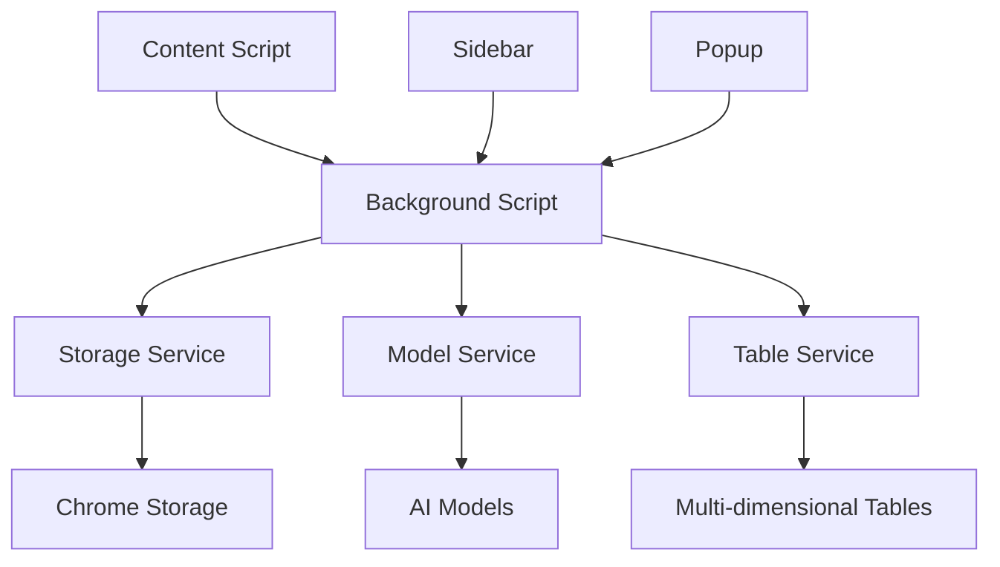

# FlowFocus V2.0 API 文档

## 目录

1. [概述](#概述)
2. [架构设计](#架构设计)
3. [核心模块](#核心模块)
4. [API接口](#api接口)
5. [数据模型](#数据模型)
6. [错误处理](#错误处理)
7. [性能优化](#性能优化)
8. [扩展开发](#扩展开发)

## 概述

FlowFocus V2.0 采用模块化架构设计，提供了完整的API接口用于文本处理、模型管理、数据同步等功能。本文档详细介绍了各个模块的API使用方法和最佳实践。

### 技术栈

- **前端**: HTML5, CSS3, JavaScript (ES2020)
- **构建工具**: Webpack 5
- **测试框架**: Jest
- **代码规范**: ESLint, Prettier
- **浏览器API**: Chrome Extension APIs

### 项目结构

```
src/
├── background/          # 后台脚本
├── content/            # 内容脚本
├── sidebar/            # 侧边栏界面
├── popup/              # 弹窗界面
├── services/           # 业务服务
├── utils/              # 工具函数
└── styles/             # 样式文件
```

## 架构设计

### 整体架构



### 消息传递机制

```javascript
// 消息类型定义
const MessageTypes = {
    REWRITE_TEXT: 'rewrite_text',
    SAVE_CONFIG: 'save_config',
    SYNC_DATA: 'sync_data',
    GET_HISTORY: 'get_history'
};
```

## 核心模块

### 1. Storage Service

存储服务模块，负责数据的持久化存储。

#### 接口定义

```javascript
class StorageService {
    /**
     * 保存数据
     * @param {string} key - 存储键
     * @param {any} value - 存储值
     * @returns {Promise<void>}
     */
    async set(key, value)
    
    /**
     * 获取数据
     * @param {string} key - 存储键
     * @returns {Promise<any>}
     */
    async get(key)
    
    /**
     * 删除数据
     * @param {string} key - 存储键
     * @returns {Promise<void>}
     */
    async remove(key)
    
    /**
     * 清空所有数据
     * @returns {Promise<void>}
     */
    async clear()
}
```

#### 使用示例

```javascript
import storageService from './services/storageService.js';

// 保存模型配置
await storageService.set('modelConfigs', [
    {
        id: 'qwen-001',
        name: '通义千问',
        modelType: 'qwen',
        apiKey: 'your-api-key'
    }
]);

// 获取配置
const configs = await storageService.get('modelConfigs');
```

### 2. Model Service

模型服务模块，负责与各大语言模型的交互。

#### 接口定义

```javascript
class ModelService {
    /**
     * 测试模型连接
     * @param {ModelConfig} config - 模型配置
     * @returns {Promise<TestResult>}
     */
    async testConnection(config)
    
    /**
     * 文本改写
     * @param {string} text - 原始文本
     * @param {RewriteOptions} options - 改写选项
     * @returns {Promise<RewriteResult>}
     */
    async rewriteText(text, options)
    
    /**
     * 获取支持的模型列表
     * @returns {Array<ModelInfo>}
     */
    getSupportedModels()
}
```

#### 模型配置格式

```typescript
interface ModelConfig {
    id: string;              // 配置ID
    name: string;            // 配置名称
    modelType: ModelType;    // 模型类型
    apiKey: string;          // API密钥
    baseUrl: string;         // API基础URL
    modelEndpoint: string;   // 模型端点
    parameters?: object;     // 额外参数
}

type ModelType = 'qwen' | 'deepseek' | 'volces' | 'kimi' | 'hunyuan';
```

#### 使用示例

```javascript
import modelService from './services/modelService.js';

// 测试连接
const testResult = await modelService.testConnection({
    modelType: 'qwen',
    apiKey: 'your-api-key',
    baseUrl: 'https://dashscope.aliyuncs.com/api/v1',
    modelEndpoint: 'qwen-turbo'
});

// 文本改写
const result = await modelService.rewriteText('原始文本', {
    mode: 'optimize',
    modelConfig: config,
    temperature: 0.7
});
```

### 3. Table Service

表格服务模块，负责与多维表格平台的数据同步。

#### 接口定义

```javascript
class TableService {
    /**
     * 测试表格连接
     * @param {TableConfig} config - 表格配置
     * @returns {Promise<TestResult>}
     */
    async testConnection(config)
    
    /**
     * 同步数据到表格
     * @param {Array<Record>} records - 记录数组
     * @param {TableConfig} config - 表格配置
     * @returns {Promise<SyncResult>}
     */
    async syncRecords(records, config)
    
    /**
     * 获取表格信息
     * @param {TableConfig} config - 表格配置
     * @returns {Promise<TableInfo>}
     */
    async getTableInfo(config)
}
```

#### 表格配置格式

```typescript
interface TableConfig {
    id: string;              // 配置ID
    name: string;            // 配置名称
    platform: Platform;     // 平台类型
    appId: string;           // 应用ID
    appSecret: string;       // 应用密钥
    tableId: string;         // 表格ID
    viewId?: string;         // 视图ID（可选）
}

type Platform = 'feishu' | 'dingtalk' | 'wework';
```

### 4. Rewrite Service

改写服务模块，提供文本改写的核心功能。

#### 接口定义

```javascript
class RewriteService {
    /**
     * 执行文本改写
     * @param {RewriteRequest} request - 改写请求
     * @returns {Promise<RewriteResponse>}
     */
    async rewrite(request)
    
    /**
     * 获取改写历史
     * @param {HistoryFilter} filter - 过滤条件
     * @returns {Promise<Array<RewriteRecord>>}
     */
    async getHistory(filter)
    
    /**
     * 保存改写记录
     * @param {RewriteRecord} record - 改写记录
     * @returns {Promise<void>}
     */
    async saveRecord(record)
}
```

#### 改写请求格式

```typescript
interface RewriteRequest {
    text: string;            // 原始文本
    mode: RewriteMode;       // 改写模式
    modelConfigId: string;   // 模型配置ID
    customPrompt?: string;   // 自定义提示词
    parameters?: {
        temperature?: number; // 温度参数
        maxTokens?: number;   // 最大令牌数
        topP?: number;        // Top-P参数
    };
}

type RewriteMode = 'optimize' | 'style' | 'length' | 'translate' | 'custom';
```

## API接口

### 消息API

#### 发送消息

```javascript
/**
 * 发送消息到后台脚本
 * @param {string} type - 消息类型
 * @param {object} data - 消息数据
 * @returns {Promise<any>}
 */
function sendMessage(type, data) {
    return new Promise((resolve, reject) => {
        chrome.runtime.sendMessage({ type, data }, (response) => {
            if (chrome.runtime.lastError) {
                reject(new Error(chrome.runtime.lastError.message));
            } else {
                resolve(response);
            }
        });
    });
}
```

#### 消息监听

```javascript
/**
 * 监听消息
 * @param {function} handler - 消息处理函数
 */
function addMessageListener(handler) {
    chrome.runtime.onMessage.addListener((message, sender, sendResponse) => {
        handler(message, sender, sendResponse);
        return true; // 保持消息通道开放
    });
}
```

### 存储API

#### Chrome Storage API封装

```javascript
const storage = {
    /**
     * 本地存储
     */
    local: {
        async get(keys) {
            return new Promise((resolve) => {
                chrome.storage.local.get(keys, resolve);
            });
        },
        
        async set(items) {
            return new Promise((resolve) => {
                chrome.storage.local.set(items, resolve);
            });
        },
        
        async remove(keys) {
            return new Promise((resolve) => {
                chrome.storage.local.remove(keys, resolve);
            });
        },
        
        async clear() {
            return new Promise((resolve) => {
                chrome.storage.local.clear(resolve);
            });
        }
    }
};
```

### 网络API

#### HTTP请求封装

```javascript
class HttpClient {
    /**
     * 发送GET请求
     * @param {string} url - 请求URL
     * @param {object} options - 请求选项
     * @returns {Promise<Response>}
     */
    async get(url, options = {}) {
        return this.request('GET', url, null, options);
    }
    
    /**
     * 发送POST请求
     * @param {string} url - 请求URL
     * @param {any} data - 请求数据
     * @param {object} options - 请求选项
     * @returns {Promise<Response>}
     */
    async post(url, data, options = {}) {
        return this.request('POST', url, data, options);
    }
    
    /**
     * 通用请求方法
     * @param {string} method - HTTP方法
     * @param {string} url - 请求URL
     * @param {any} data - 请求数据
     * @param {object} options - 请求选项
     * @returns {Promise<Response>}
     */
    async request(method, url, data, options = {}) {
        const config = {
            method,
            headers: {
                'Content-Type': 'application/json',
                ...options.headers
            },
            ...options
        };
        
        if (data) {
            config.body = JSON.stringify(data);
        }
        
        const response = await fetch(url, config);
        
        if (!response.ok) {
            throw new Error(`HTTP ${response.status}: ${response.statusText}`);
        }
        
        return response;
    }
}
```

## 数据模型

### 改写记录

```typescript
interface RewriteRecord {
    id: string;              // 记录ID
    originalText: string;    // 原始文本
    rewriteResult: string;   // 改写结果
    mode: RewriteMode;       // 改写模式
    modelConfigId: string;   // 模型配置ID
    modelType: ModelType;    // 模型类型
    prompt: string;          // 使用的提示词
    parameters: object;      // 模型参数
    createdAt: string;       // 创建时间
    duration: number;        // 处理耗时（毫秒）
    success: boolean;        // 是否成功
    error?: string;          // 错误信息
    metadata?: object;       // 元数据
}
```

### 同步记录

```typescript
interface SyncRecord {
    id: string;              // 同步ID
    tableConfigId: string;   // 表格配置ID
    recordIds: string[];     // 同步的记录ID列表
    status: SyncStatus;      // 同步状态
    startTime: string;       // 开始时间
    endTime?: string;        // 结束时间
    recordCount: number;     // 记录数量
    successCount: number;    // 成功数量
    failedCount: number;     // 失败数量
    error?: string;          // 错误信息
}

type SyncStatus = 'pending' | 'running' | 'success' | 'failed' | 'cancelled';
```

### 配置模型

```typescript
interface AppConfig {
    version: string;         // 应用版本
    theme: 'light' | 'dark'; // 主题模式
    language: string;        // 语言设置
    autoSync: boolean;       // 自动同步
    syncInterval: number;    // 同步间隔（分钟）
    maxRecords: number;      // 最大记录数
    performance: {
        enableMonitoring: boolean;
        memoryLimit: number;
        cacheSize: number;
    };
}
```

## 错误处理

### 错误类型定义

```typescript
enum ErrorType {
    NETWORK = 'network',
    API = 'api',
    STORAGE = 'storage',
    VALIDATION = 'validation',
    PERMISSION = 'permission',
    TIMEOUT = 'timeout',
    UNKNOWN = 'unknown'
}

interface FlowFocusError {
    type: ErrorType;
    code: string;
    message: string;
    details?: any;
    timestamp: string;
    stack?: string;
}
```

### 错误处理器

```javascript
class ErrorHandler {
    /**
     * 处理错误
     * @param {Error} error - 错误对象
     * @param {string} context - 错误上下文
     */
    handleError(error, context = '') {
        const flowFocusError = this.normalizeError(error, context);
        this.logError(flowFocusError);
        this.notifyUser(flowFocusError);
    }
    
    /**
     * 标准化错误
     * @param {Error} error - 原始错误
     * @param {string} context - 错误上下文
     * @returns {FlowFocusError}
     */
    normalizeError(error, context) {
        return {
            type: this.classifyError(error),
            code: this.generateErrorCode(error),
            message: error.message || '未知错误',
            details: { context, originalError: error },
            timestamp: new Date().toISOString(),
            stack: error.stack
        };
    }
}
```

### 重试机制

```javascript
class RetryManager {
    /**
     * 带重试的异步操作
     * @param {function} operation - 操作函数
     * @param {RetryOptions} options - 重试选项
     * @returns {Promise<any>}
     */
    async withRetry(operation, options = {}) {
        const {
            maxRetries = 3,
            delay = 1000,
            backoff = 2,
            shouldRetry = () => true
        } = options;
        
        let lastError;
        
        for (let attempt = 0; attempt <= maxRetries; attempt++) {
            try {
                return await operation();
            } catch (error) {
                lastError = error;
                
                if (attempt === maxRetries || !shouldRetry(error)) {
                    throw error;
                }
                
                const waitTime = delay * Math.pow(backoff, attempt);
                await this.sleep(waitTime);
            }
        }
        
        throw lastError;
    }
    
    sleep(ms) {
        return new Promise(resolve => setTimeout(resolve, ms));
    }
}
```

## 性能优化

### 缓存管理

```javascript
class CacheManager {
    constructor(maxSize = 100, ttl = 300000) {
        this.cache = new Map();
        this.maxSize = maxSize;
        this.ttl = ttl;
    }
    
    /**
     * 设置缓存
     * @param {string} key - 缓存键
     * @param {any} value - 缓存值
     * @param {number} ttl - 生存时间
     */
    set(key, value, ttl = this.ttl) {
        if (this.cache.size >= this.maxSize) {
            const firstKey = this.cache.keys().next().value;
            this.cache.delete(firstKey);
        }
        
        this.cache.set(key, {
            value,
            timestamp: Date.now(),
            ttl
        });
    }
    
    /**
     * 获取缓存
     * @param {string} key - 缓存键
     * @returns {any}
     */
    get(key) {
        const item = this.cache.get(key);
        
        if (!item) return null;
        
        if (Date.now() - item.timestamp > item.ttl) {
            this.cache.delete(key);
            return null;
        }
        
        return item.value;
    }
}
```

### 防抖和节流

```javascript
/**
 * 防抖函数
 * @param {function} func - 目标函数
 * @param {number} wait - 等待时间
 * @param {boolean} immediate - 是否立即执行
 * @returns {function}
 */
function debounce(func, wait, immediate = false) {
    let timeout;
    
    return function executedFunction(...args) {
        const later = () => {
            timeout = null;
            if (!immediate) func.apply(this, args);
        };
        
        const callNow = immediate && !timeout;
        clearTimeout(timeout);
        timeout = setTimeout(later, wait);
        
        if (callNow) func.apply(this, args);
    };
}

/**
 * 节流函数
 * @param {function} func - 目标函数
 * @param {number} limit - 限制时间
 * @returns {function}
 */
function throttle(func, limit) {
    let inThrottle;
    
    return function() {
        const args = arguments;
        const context = this;
        
        if (!inThrottle) {
            func.apply(context, args);
            inThrottle = true;
            setTimeout(() => inThrottle = false, limit);
        }
    };
}
```

### 内存监控

```javascript
class MemoryMonitor {
    /**
     * 获取内存使用情况
     * @returns {object}
     */
    getMemoryUsage() {
        if (!performance.memory) return null;
        
        return {
            used: Math.round(performance.memory.usedJSHeapSize / 1024 / 1024),
            total: Math.round(performance.memory.totalJSHeapSize / 1024 / 1024),
            limit: Math.round(performance.memory.jsHeapSizeLimit / 1024 / 1024)
        };
    }
    
    /**
     * 检查内存使用率
     * @returns {number} 使用率百分比
     */
    getUsagePercentage() {
        const memory = this.getMemoryUsage();
        if (!memory) return 0;
        
        return (memory.used / memory.limit) * 100;
    }
    
    /**
     * 内存清理
     */
    cleanup() {
        // 清理缓存
        if (window.cacheManager) {
            window.cacheManager.clear();
        }
        
        // 触发垃圾回收（如果可用）
        if (window.gc) {
            window.gc();
        }
    }
}
```

## 扩展开发

### 添加新的模型支持

1. **定义模型配置**

```javascript
// 在 constants.js 中添加新模型类型
const MODEL_TYPES = {
    // 现有模型...
    NEW_MODEL: 'new_model'
};

// 添加模型配置模板
const MODEL_CONFIGS = {
    // 现有配置...
    [MODEL_TYPES.NEW_MODEL]: {
        name: '新模型',
        baseUrl: 'https://api.newmodel.com/v1',
        defaultEndpoint: 'new-model-chat',
        requiredFields: ['apiKey', 'baseUrl'],
        supportedFeatures: ['chat', 'completion']
    }
};
```

2. **实现模型适配器**

```javascript
class NewModelAdapter {
    constructor(config) {
        this.config = config;
    }
    
    async testConnection() {
        try {
            const response = await fetch(`${this.config.baseUrl}/models`, {
                headers: {
                    'Authorization': `Bearer ${this.config.apiKey}`
                }
            });
            
            return { success: response.ok };
        } catch (error) {
            return { success: false, error: error.message };
        }
    }
    
    async rewriteText(text, options) {
        const requestBody = {
            model: this.config.modelEndpoint,
            messages: [
                {
                    role: 'user',
                    content: this.buildPrompt(text, options)
                }
            ],
            temperature: options.temperature || 0.7
        };
        
        const response = await fetch(`${this.config.baseUrl}/chat/completions`, {
            method: 'POST',
            headers: {
                'Content-Type': 'application/json',
                'Authorization': `Bearer ${this.config.apiKey}`
            },
            body: JSON.stringify(requestBody)
        });
        
        const data = await response.json();
        
        return {
            success: true,
            result: data.choices[0].message.content,
            usage: data.usage
        };
    }
    
    buildPrompt(text, options) {
        // 构建提示词逻辑
        return `请改写以下文本：\n\n${text}`;
    }
}
```

3. **注册模型适配器**

```javascript
// 在 modelService.js 中注册
const MODEL_ADAPTERS = {
    // 现有适配器...
    [MODEL_TYPES.NEW_MODEL]: NewModelAdapter
};
```

### 添加新的表格平台支持

1. **定义平台配置**

```javascript
const TABLE_PLATFORMS = {
    // 现有平台...
    NEW_PLATFORM: 'new_platform'
};

const PLATFORM_CONFIGS = {
    // 现有配置...
    [TABLE_PLATFORMS.NEW_PLATFORM]: {
        name: '新平台',
        authType: 'oauth2',
        requiredFields: ['clientId', 'clientSecret'],
        apiVersion: 'v1'
    }
};
```

2. **实现平台适配器**

```javascript
class NewPlatformAdapter {
    constructor(config) {
        this.config = config;
        this.accessToken = null;
    }
    
    async authenticate() {
        // 实现认证逻辑
        const response = await fetch(`${this.config.baseUrl}/oauth/token`, {
            method: 'POST',
            headers: {
                'Content-Type': 'application/json'
            },
            body: JSON.stringify({
                client_id: this.config.clientId,
                client_secret: this.config.clientSecret,
                grant_type: 'client_credentials'
            })
        });
        
        const data = await response.json();
        this.accessToken = data.access_token;
    }
    
    async syncRecords(records) {
        if (!this.accessToken) {
            await this.authenticate();
        }
        
        const results = [];
        
        for (const record of records) {
            try {
                const response = await fetch(`${this.config.baseUrl}/tables/${this.config.tableId}/records`, {
                    method: 'POST',
                    headers: {
                        'Content-Type': 'application/json',
                        'Authorization': `Bearer ${this.accessToken}`
                    },
                    body: JSON.stringify(this.transformRecord(record))
                });
                
                results.push({ success: response.ok, recordId: record.id });
            } catch (error) {
                results.push({ success: false, recordId: record.id, error: error.message });
            }
        }
        
        return results;
    }
    
    transformRecord(record) {
        // 转换记录格式以适配平台API
        return {
            fields: {
                'Original Text': record.originalText,
                'Rewrite Result': record.rewriteResult,
                'Model Type': record.modelType,
                'Created At': record.createdAt
            }
        };
    }
}
```

### 自定义事件系统

```javascript
class EventEmitter {
    constructor() {
        this.events = {};
    }
    
    on(event, listener) {
        if (!this.events[event]) {
            this.events[event] = [];
        }
        this.events[event].push(listener);
    }
    
    off(event, listenerToRemove) {
        if (!this.events[event]) return;
        
        this.events[event] = this.events[event].filter(
            listener => listener !== listenerToRemove
        );
    }
    
    emit(event, ...args) {
        if (!this.events[event]) return;
        
        this.events[event].forEach(listener => {
            listener.apply(this, args);
        });
    }
}

// 全局事件总线
const eventBus = new EventEmitter();

// 使用示例
eventBus.on('rewrite:start', (data) => {
    console.log('开始改写:', data);
});

eventBus.on('rewrite:complete', (result) => {
    console.log('改写完成:', result);
});

eventBus.emit('rewrite:start', { text: '原始文本' });
```

### 插件钩子系统

```javascript
class PluginManager {
    constructor() {
        this.plugins = [];
        this.hooks = {};
    }
    
    /**
     * 注册插件
     * @param {object} plugin - 插件对象
     */
    register(plugin) {
        this.plugins.push(plugin);
        
        if (plugin.hooks) {
            Object.keys(plugin.hooks).forEach(hookName => {
                this.addHook(hookName, plugin.hooks[hookName]);
            });
        }
        
        if (plugin.init) {
            plugin.init();
        }
    }
    
    /**
     * 添加钩子
     * @param {string} name - 钩子名称
     * @param {function} handler - 处理函数
     */
    addHook(name, handler) {
        if (!this.hooks[name]) {
            this.hooks[name] = [];
        }
        this.hooks[name].push(handler);
    }
    
    /**
     * 执行钩子
     * @param {string} name - 钩子名称
     * @param {any} data - 传递的数据
     * @returns {any} 处理后的数据
     */
    async executeHook(name, data) {
        if (!this.hooks[name]) return data;
        
        let result = data;
        
        for (const handler of this.hooks[name]) {
            result = await handler(result);
        }
        
        return result;
    }
}

// 使用示例
const pluginManager = new PluginManager();

// 注册文本预处理插件
pluginManager.register({
    name: 'TextPreprocessor',
    hooks: {
        'before:rewrite': (text) => {
            // 文本预处理逻辑
            return text.trim().replace(/\s+/g, ' ');
        }
    }
});

// 在改写前执行钩子
const processedText = await pluginManager.executeHook('before:rewrite', originalText);
```

---

## 版本信息

- **当前版本**: 2.0.0
- **API版本**: v1
- **最后更新**: 2024-12-XX

## 许可证

本API文档遵循 MIT 许可证。

---

**注意**: 本文档持续更新中，如有疑问请参考源代码或联系开发团队。